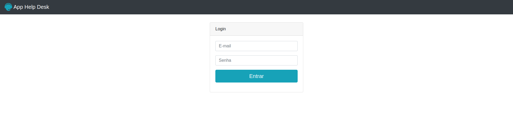
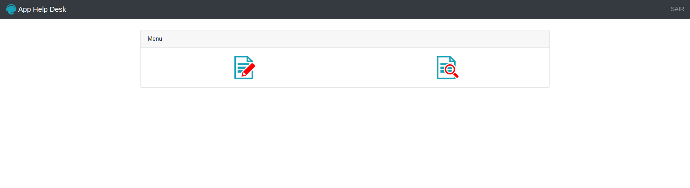
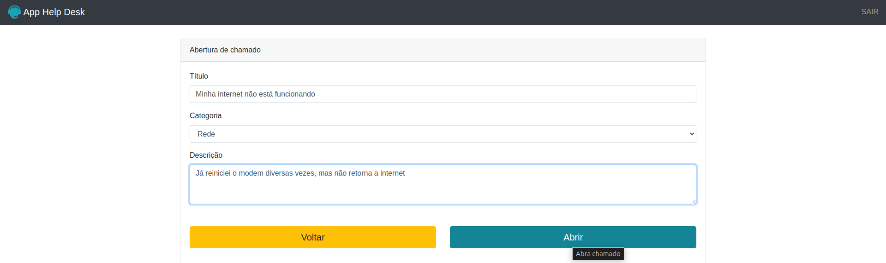
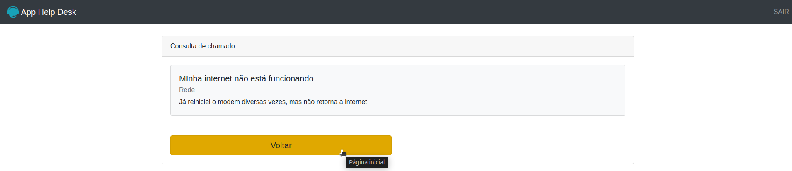

#  Help Desk PHP

Bem-vindo ao repositório do **Help Desk PHP**! Este projeto foi desenvolvido com o objetivo de colocar em prática os conceitos aprendidos em PHP, com foco no uso de suas funções nativas e no desenvolvimento de uma aplicação simples de atendimento ao cliente (*Help Desk*).

## Sobre o Projeto
O **Help Desk PHP** é uma aplicação web que permite gerenciar tickets de atendimento ao cliente. Com ele, é possível:
- Criar e visualizar tickets
- Listar todos os tickets abertos
- Permitir que os usuários acompanhem o status de seus chamados
- Responsivo

Esse projeto visa aprimorar habilidades práticas em PHP e fornece uma base para entender como funcionam sistemas de suporte e atendimento, muito úteis em ambientes corporativos.

## Funcionalidades
- **Cadastro de Tickets**: Usuários podem cadastrar um novo chamado, incluindo título, descrição e prioridade.
- **Listagem de Tickets**: Visualização dos tickets com status atualizado.

##  Tecnologias Utilizadas
- **PHP**: Utilizando várias funções nativas para manipulação de dados, gestão de sessões e interação com banco de dados.
- **HTML/CSS/Bootstrap**: Interface web para o usuário com estilo básico e responsivo.

Demonstração 
> *Exemplo de uma interface do Help Desk PHP com listagem de tickets e status.*

Visualização do projeto: 

